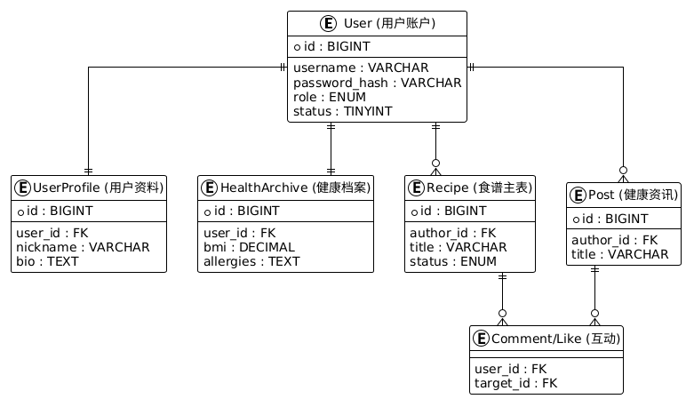
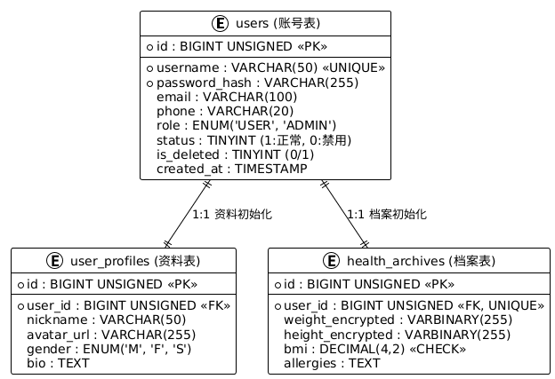
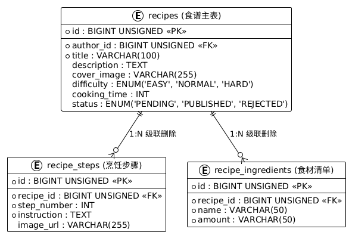
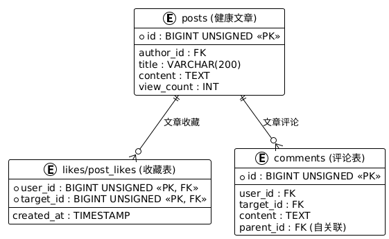
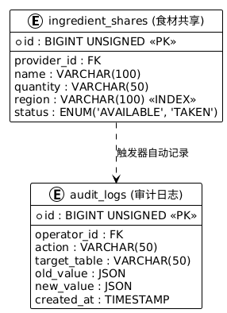

# 🗄️ 健康饮食交流平台 - 数据库逻辑说明文档

本项目的核心在于展示数据库的设计深度，涵盖了从基础建模到高级特性（触发器、存储过程、视图、加密）的全面应用。

## 0. 数据库全量 ER 图

## 1. 数据库架构设计 (E-R 逻辑)

本项目包含 11 张核心表，主要分为以下四个模块：

### 1.1 用户与安全模块

- **users**：账户主表，包含密码哈希、账户状态、逻辑删除。
- **user_profiles**：用户基本资料，与 users 一对一关联。
- **health_archives**：敏感健康档案，支持 **CHECK 约束**。

### 1.2 内容管理模块

- **recipes**：食谱主表，包含难度、时间、状态审核。
- **recipe_steps**：级联存储烹饪步骤。
- **recipe_ingredients**：存储所需食材。
- **posts**：健康资讯文章表。

### 1.3 社区互动模块

- **comments / post_comments**：实现用户对内容的多对多互动。
- **likes / post_likes**：通过 **复合主键 (user_id, target_id)** 确保收藏行为的唯一性。

### 1.4 食材共享与审计

- **ingredient_shares**：记录余量食材，包含区域信息。
- **audit_logs**：审计日志表，采用 **JSON 格式** 存储变更前后的原始数据。

---

## 2. 数据库高级特性应用

### 2.1 安全脱敏视图 (`v_recipe_details`)
为了保障用户信息安全，我们创建了一个视图，在展示食谱详情时：
- 自动关联作者昵称。
- **数据脱敏**：使用 SQL 函数对作者手机号进行 `138****5678` 格式的处理。
- **数据聚合**：实时计算该食谱的点赞数和评论数。

### 2.2 自动化审计触发器 (`tr_audit_comment_delete`)
- **逻辑**：当管理员或用户删除一条评论时，触发器会自动捕获该行为。
- **行为**：将删除时间、操作人信息、旧的内容数据以 JSON 形式存入 `audit_logs` 表，实现操作的可溯源性。

### 2.3 原子性存储过程 (`sp_register_user`)
- **功能**：处理用户注册。
- **深度体现**：在一个 **事务 (Transaction)** 中同时初始化账户、个人资料和健康档案。通过 `START TRANSACTION` 和 `COMMIT` 确保三个模块的数据一致性，避免产生孤儿数据。

### 2.4 数据完整性约束
- **外键约束**：全量使用 `ON DELETE CASCADE` 确保删除用户或食谱时，关联数据自动清理。
- **CHECK 约束**：在健康档案中限制 BMI 值范围，从数据库层面防止垃圾数据注入。

---

## 3. 性能优化
- **索引优化**：
    - 对频繁查询的 `username`, `email` 建立 **UNIQUE 索引**。
    - 对内容状态 `status` 和 逻辑删除位 `is_deleted` 建立普通索引，提升列表检索速度。
- **字段选型**：大量使用 `UNSIGNED` 类型节省空间，使用 `TIMESTAMP` 自动记录变更时间。

